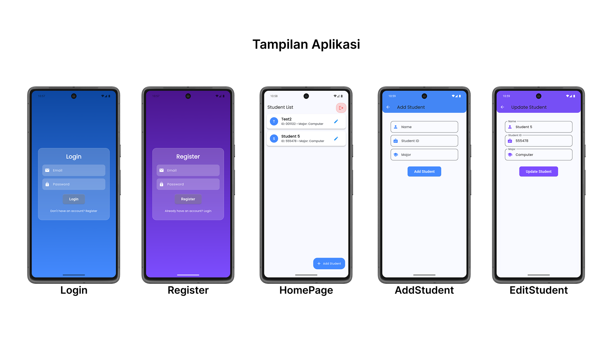

# Student App Data

A Flutter CRUD application for managing student records with SQLite.

## Features
- **Register & Login System** (Data stored in SQLite)
- **Add, Update, and Delete Students**
- **Swipe to Delete & Multi-Select Delete**
- **Beautiful Modern UI with Glassmorphism Effects**
- **Themed Add/Edit Pages (Blue for Add, Purple for Edit)**
- **Dark & Light Mode Support**

## Technologies Used
- **Flutter** (Dart)
- **SQLite** (sqflite package for local database storage)
- **Provider** (State management)
- **GoRouter** (Navigation)
- **SharedPreferences** (Persisting login state)

## Installation
1. Clone this repository:
   ```bash
   git clone https://github.com/mhdthariq/StudentApp.git student_app_date
   ```
2. Navigate to the project directory:
   ```bash
   cd student_app_data
   ```
3. Install dependencies:
   ```bash
   flutter pub get
   ```
4. Run the app:
   ```bash
   flutter run
   ```

## Screenshots


## Future Enhancements
- Cloud sync with Firebase
- Advanced search & filtering
- Export student data to CSV/PDF

For help getting started with Flutter development, view the
[Flutter documentation](https://docs.flutter.dev/), which offers tutorials, samples, and guidance.